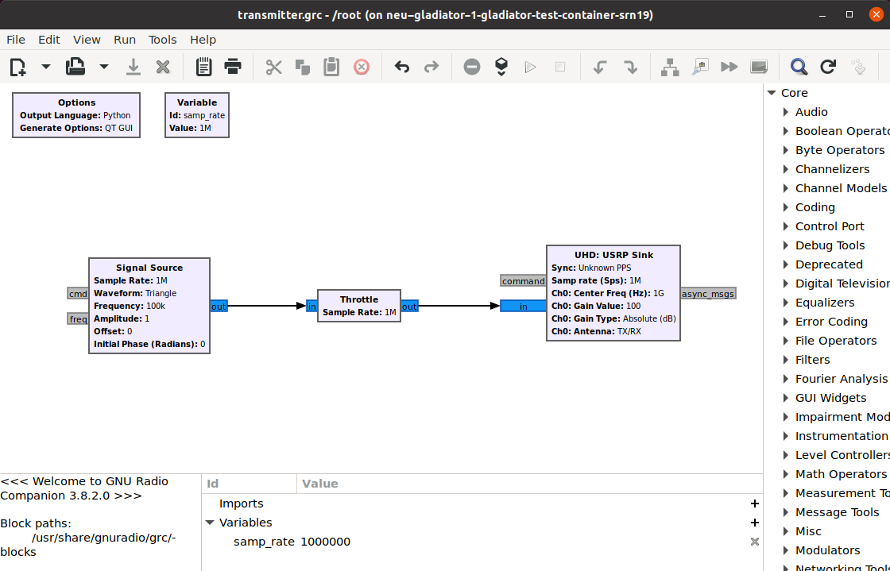
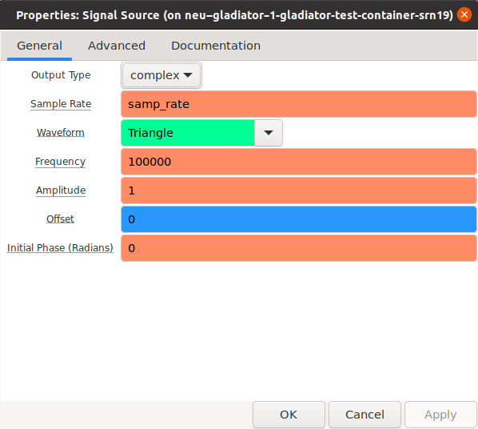
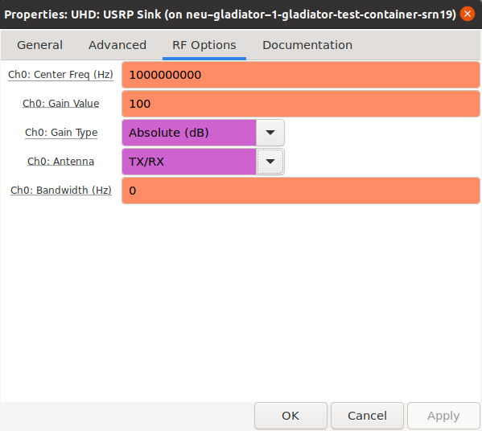
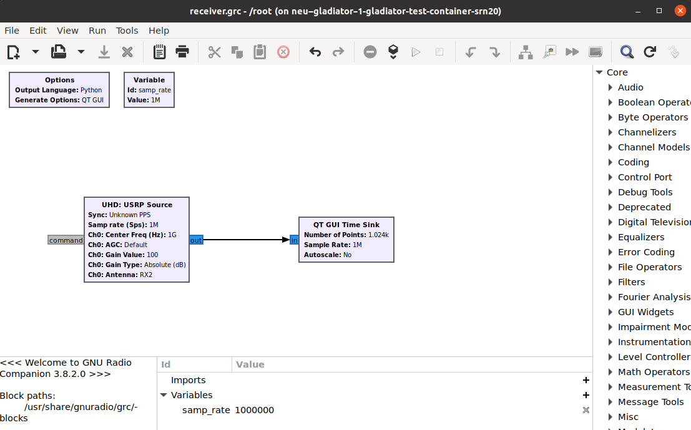
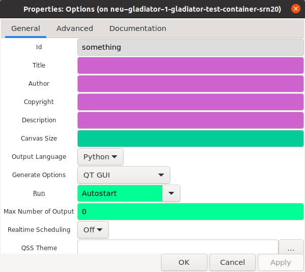
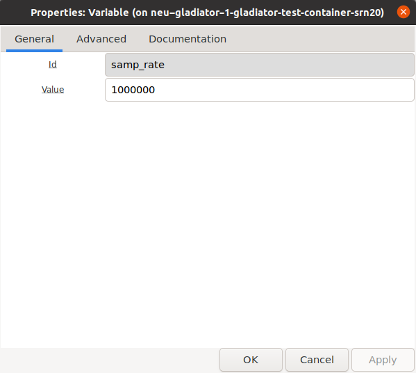
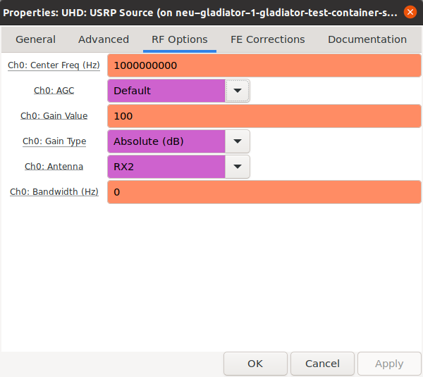
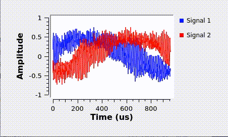

# Custom Container Assignment

In this assignment, we will first create a custom LXC container by adding a Graphical User Interface (GUI) for [GNU Radio](https://www.gnuradio.org/), then we will upload and use this container in an interactive reservation to stream samples from a USRP device acting as transmitter to another USRP device acting as receiver.

## Pre-requisites

- A Linux OS (e.g., Ubuntu) with [Colossum VPN](https://colosseumneu.freshdesk.com/support/solutions/articles/61000285824-cisco-anyconnect-remote-vpn-access) and LXC installed. If you are using the virtual machine provided by the Colosseum team, these steps are already covered and you just need to setup your identity.
- Students have set up their SSH keys ([Upload SSH Public Keys](https://colosseumneu.freshdesk.com/en/support/solutions/articles/61000253402-upload-ssh-public-keys)) and SSH file-proxy ([SSH Proxy Setup](https://colosseumneu.freshdesk.com/en/support/solutions/articles/61000253369-ssh-proxy-setup)).
- Students are able to successfully access to Colosseum resources ([Accessing Colosseum Resources](https://colosseumneu.freshdesk.com/en/support/solutions/articles/61000253362-accessing-colosseum-resources)), e.g., log into the SSH gateway and file-proxy servers.
- Students are assigned to the Colosseum team `gladiators`. (Even if you have already a Colosseum account, please use the accounts that has been created for you for the Colosseum school.)

## Container Customization

1. Open a terminal in your Linux OS, and use the following command to transfer the base image from the file-proxy server to a local folder:

    ```bash
    rsync -vP -e ssh file-proxy:/share/nas/gladiators/images/base-2104.tar.gz ./
    ```

    This will establish a communication over the network and download a container archived image.

2. Ensure your user has the required privileges to use LXC. To check that, look for the following lines in the files `/etc/subuid` and `/etc/subgid`

    ```config
    lxd:100000:65536
    root:100000:65536
    ```

   - If such lines are missing, use your preferred text editor to write them (e.g., `sudo gedit /etc/subuid /etc/subgid`).
   - Remember to restart the LXD service after this change: `sudo systemctl restart lxd`, `sudo snap restart lxd`, or `sudo service lxd restart`.

3. Import the archived image in lxc:

    ```bash
    lxc image import base-2104.tar.gz --alias base 
    ```

    The outcome of this operation can be also confirmed with the command `lxc image list`, which should show the new image.

4. Initialize and launch the container:

    ```bash
    lxc init local:base my-container
    lxc start my-container
    ```

    Containers are _running instances of images_.
    They share all the contents in terms of files and folders of an image but they can also be modified and their executables can be run.
    By starting the container `my-container` from the `base` image, we can prepare our software starting from the imported `base-2104` archive (avoiding to start from scratch), and later commit it (i.e., save it) in another image which can be treated as an immutable snapshot of the container.

5. To access and make any change in the running container we type the command:

    ```bash
    lxc exec my-container /bin/bash
    ```

    The above command launches a process (the bash command shell) inside the container `my-container`.
    This action is the equivalent of opening a terminal in a Linux OS or logging into a remote Linux server.

6. Before starting the customization of the container, you can start by choosing a new password typing the following command in the container terminal: `passwd`
    Please write down the password you choose. This will be important later on, when you start your reservation on Colosseum and you are prompted with the password for the container. Alternatively, you can set up an SSH Private-Public Key access. However, this procedure will not be covered in this tutorial.

7. The process of installing mainstream software is the same of any Ubuntu machine. For this assignment, we install the `gnuradio-companion` package:

    ```bash
    apt update
    apt install -y gnuradio gir1.2-gtk-3.0
    ```

    This will install `gnuradio-companion`, which is a GUI for [GNU Radio](https://www.gnuradio.org/), and allows the visual composition of signal processing workflows. It can readily be used for experiments on Colosseum.

8. Now, we are ready to commit our changes and stop the container:

    ```bash
    exit  # terminate of the bash shell in the container
    lxc stop my-container  # stop of the container
    lxc publish my-container --alias my_image  # creation of a new image called my_image
    lxc image list  # check that the image my_image has been correctly created
    ```

   Stopping the container terminates the processes running from its executables and editing its files; it is an important step to avoid data inconsistency while publishing (committing) the changes. The publishing makes a snapshot of the container and saves it in a new image.

9. Export the updated image in an archive: `lxc image export my_image insert_your_last_name`. This step is required to handle and transfer an image. (Please, in the above, replace `insert_your_last_name` with your last name.)

10. Upload your newly archived image to Colosseum servers:

    ```bash
    rsync -vP -e ssh <insert_your_last_name>.tar.gz file-proxy:/share/nas/gladiators/images/
    ```

Colosseum presents to its users the available containers images in the related team folder. By transferring the archived image in the folder indicated above, you are making it available to all the users of your team.

## Experimenting with your custom container

1. Login to [Colosseum website](https://experiments.colosseum.net).

2. Make a reservation with the `insert_your_last_name` image created in the previous step. The reservation should have two SRNs (see instructions on [Making a Reservation](https://colosseumneu.freshdesk.com/en/support/solutions/articles/61000253463-making-a-reservation-interactive-and-batch-mode-)). Call the reservation in a meaningful way (e.g., your name). Two hours should suffice.

3. In the reservation page, you can find the assigned SRNs/nodes and their hostnames by hovering over nodes. At your scheduled reservation time, **open two terminals** and ssh into the assigned Colosseum SRNs (see instructions on [Logging into an SRN](https://colosseumneu.freshdesk.com/en/support/solutions/articles/61000253366-logging-into-an-srn)):

    ```bash
    ssh -Y <srn-hostname> # <srn-hostname> is usually <team-name>-<srn-id>.  # for this class gladiators-<srn-id>
    ```

    Please note that: this command will not work if you have not setup your ssh config files by following the instructions in SSH Proxy Setup (see the pre-requisites section for more information). Moreover, the `-Y` flag allows the use of GUI applications. Some old `ssh` versions may still use the `-X` flag for the same purpose, thus if you are not able to see any graphical output after the step 6 of this section, logout and login again with the command `ssh <srn-hostname> -X`. Finally, the password is the one you have set on step 6 of the previous Container Customization section.

4. In one of the terminals, run the following command to start a Colosseum Radio-frequency (RF) scenario through the Colosseum CLI API (see instructions [here](https://colosseumneu.freshdesk.com/en/support/solutions/articles/61000253397-colosseum-cli)). When the scenario starts, an output similar to the following is returned (time is in UTC):

    ```bash
    colosseumcli rf start 1009 -c
    ```

    You should receive an output similar to

    ```bash
    Scenario Start Time is 22:30:45
    ```

    This will engage the Colosseum Massive Channel Emulator and make the necessary connections between the USRPs of the reserved nodes based on the parameters set in the specific RF scenario (see the [Scenario Summary List](https://colosseumneu.freshdesk.com/en/support/solutions/articles/61000276224-scenarios-summary-list)). In this assignment, we will use the [Test Scenario All Paths 0 dB (1009)](https://colosseumneu.freshdesk.com/support/solutions/articles/61000277641-test-scenario-all-paths-0-db-1009). You can check if the RF scenario is active and running by executing the following command: `colosseumcli rf info`.

5. In both terminals, update the FPGA firmware `./flash_fpga_x310.sh`. This step ensures the correct firmware is present in the Software Defined Radios by flashing its bitfile.

6. In both terminals, execute the following command to open the GUI (ignore any warnings that might pop up): `gnuradio-companion`. We will use one node as transmitter and the other one as receiver.

### Transmitter GUI

1. Create the following graph with blocks: _Signal Source_, _Throttle_, and _UHD: USRP Sink_ (you can search for a block through the lent icon).

<p align="center">
  
</p>

2. Double-click on the _Options_ block to open the block settings and specify the _Id_ to “something”. Some blocks do not support Python, meaning that the code GNU Radio is going to create cannot be written in such language. In these case, you can set here "C++" as the output language.

<p align="center">
  
</p>


3. Double-click on the _Variable_ block and specify a sampling rate value of 1 MHz (1000000).

<p align="center">
  
</p>

4. Double-click on the _Signal Source_ and specify a Triangle waveform and a frequency of 1 MHz (1000000).

<p align="center">
  
</p>

5. Double-click on the _UHD: USRP Sink_ block and in the RF Options tab specify a central frequency of 1 GHz (1000000000) and a Channel Gain Value of 100.

<p align="center">
  
</p>

### Receiver GUI

   1. Create the following graph with blocks: _UHD: USRP Source_ and _QT GUI Time Sink_ (you can search for a block through the lent icon).
        
<p align="center">
    
</p>

   2. Double-click on the _Options_ block to open the block settings and specify the _Id_ to “something”.

<p align="center">
    
</p>

   3. Double-click on the _Variable_ block and specify a sampling rate Value of 1 MHz (1000000).

<p align="center">
    
</p>

   4. Double-click on the _USRP Source_ block and in the RF Options tab specify a central frequency of 1 GHz (1000000000) and a Channel Gain Value of 100.

<p align="center">
    
</p>

### Running the experiment

1. To start a system, click on the execute button in the setting bar. You will be prompted to save the sketch somewhere before actually start the processing. Save them and start both the receiver and the transmitter. If everything goes as expected, the output should be similar to this.

<p align="center">
    
</p>

2. To stop the systems, simply close the windows or click the stop button.
3. Optional: try to change the signal type and the transmission gain and notice any difference that might occur.

## Clean up

This concludes Colosseum Custom Container assignment. After you are done with your experiments, it is good practice to stop the RF scenario by running the following command from within one of the SRN containers and to terminate your reservation from the Colosseum portal:

- `colosseumcli rf stop`. Running this command on just one terminal is enough since the scenario process is shared amoing the SRNs in the same reservation.
- In all terminals, close your ssh connections by typing: `exit`.
- (Optional) Access the Colosseum portal and delete your reservation. This will free the Colosseum's resources.
